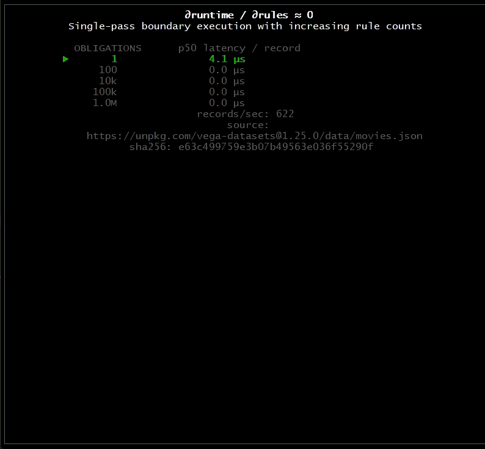

# ∂runtime / ∂rules ≈ 0

A small experiment in single-pass boundary execution showing per-record runtime invariant to the number of compiled obligations.

The behavior is the point.

---

This work is provisionally patented.  
Contact: mike [at] greased-lightning [dot] io
